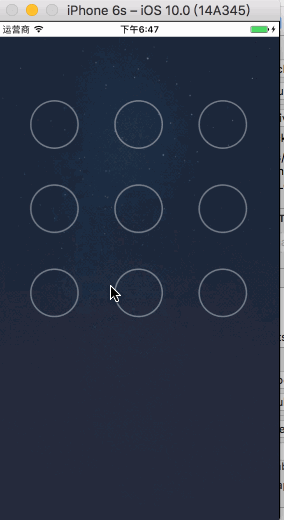

# NineLockViewDemo
九宫格解锁图

> 学习于黑马视频，不是打广告，吃水不忘挖井人而已。
  
> 支持XIB和代码创建 XIB 直接 创建的View 继承DSLockView 就可以
 代码创建ViewController 中有例子
  
> 有一些属性 我懒得拿出来 可以直接在 .m中找到 比如说线的宽度等 
 

## 集成下载demo 即可明白
* 如果真不懂可以issues me